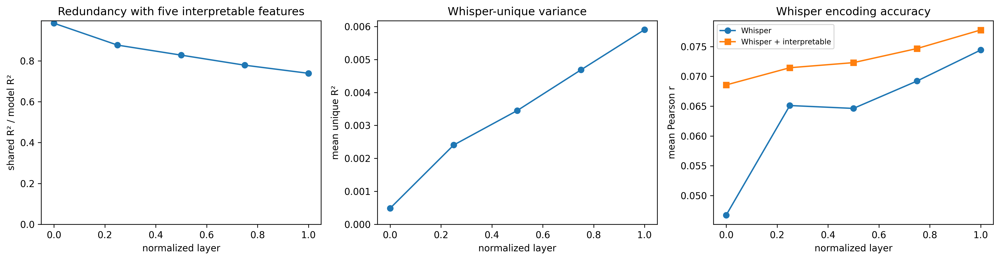
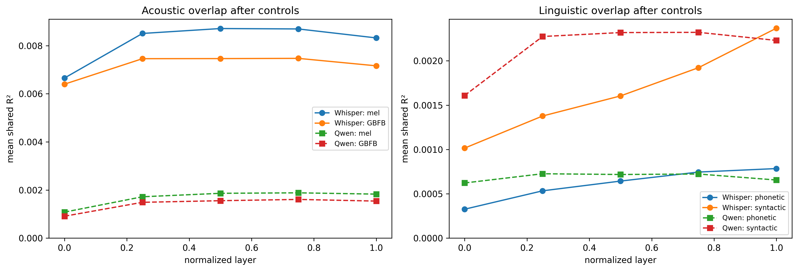
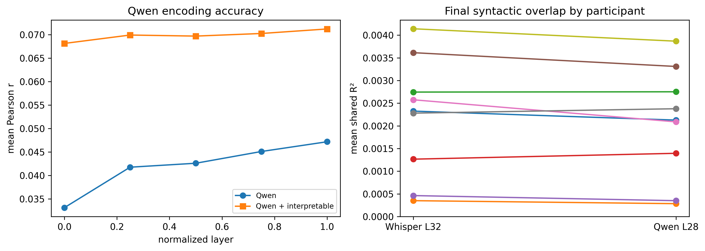
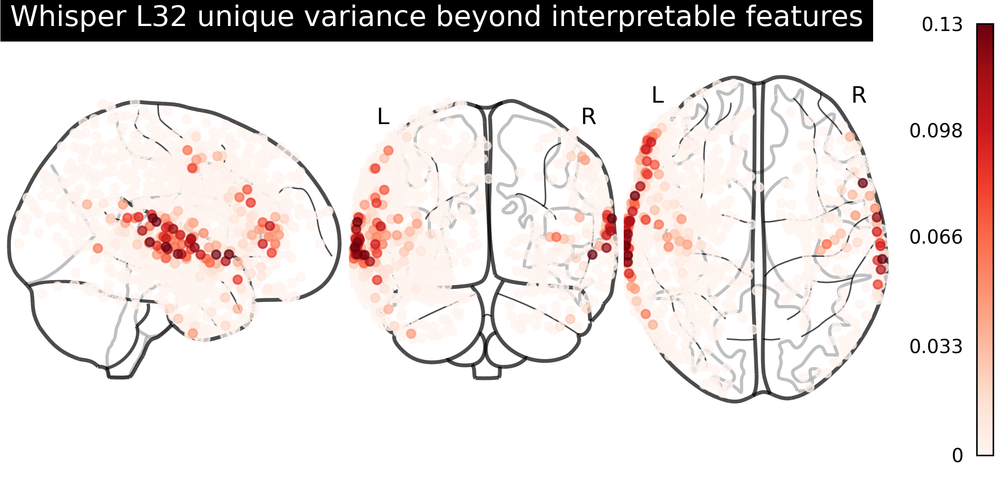
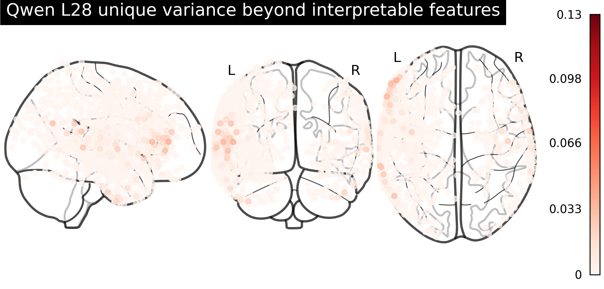
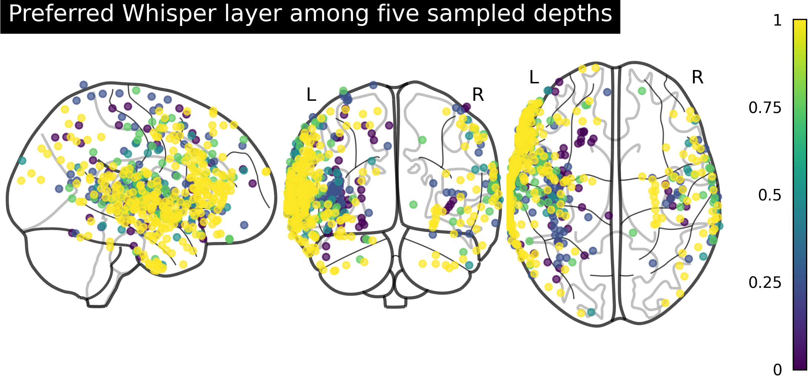
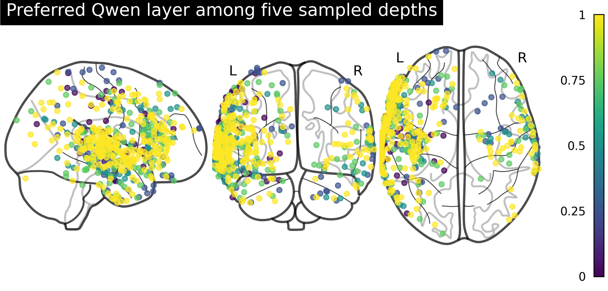

# Speech and Text Model Encoding of ECoG Responses

This project studies what speech and text models capture about brain activity during natural listening.

It starts with a partial replication of Shimizu et al. using Whisper. It then adds a text-model comparison using Qwen representations from the aligned transcript.

## The problem

Speech models can predict neural activity while a person listens to speech. A high prediction score does not tell us what information the model is using.

The model may be tracking simple parts of the stimulus, such as sound energy or phoneme timing. It may also contain information that is not captured by these simpler features.

The project asks two questions:

1. How much of Whisper's neural prediction can be explained by interpretable speech features?
2. After controlling for speech and timing, how do Whisper and Qwen differ in their acoustic and linguistic overlap with ECoG responses?

## Data

The analysis uses the open Podcast ECoG dataset. Nine participants listened to a 30-minute spoken story while intracranial recordings were collected. The target is high-gamma activity from 1,268 electrodes, sampled at 4 Hz after preprocessing.

## Approach

Five interpretable feature sets were aligned with the neural recordings:

- mel-spectrogram features
- spectro-temporal Gabor filter-bank features
- speech presence
- phonetic features
- syntactic features

Representations were also extracted from five depths of Whisper Large V1 and Qwen2.5-7B. Whisper used the audio. Qwen used the time-aligned transcript.

Banded ridge regression was fitted with five contiguous cross-validation folds. Model context was reset at each fold boundary.

For the speech-versus-text comparison, the analysis controlled for speech probability and a small timing block containing word count, phoneme count, and time since the previous word ended.

Shared R² is reported as an absolute value. It measures the neural variance shared by a model and an interpretable feature after these controls are removed.

## Results

### 1. Whisper analysis

Across depth, the proportion of Whisper-predicted variance shared with the five interpretable features fell from **0.984 to 0.739**. Whisper-unique R² increased from **0.00049 to 0.00590**, while neural prediction correlation increased from **0.047 to 0.074**.

### 2. Speech and text representations

After controlling for speech and timing, Whisper retained much more overlap with acoustic features.

| Final layer | Whisper | Qwen |
|---|---:|---:|
| Mel shared R² | 0.00832 | 0.00183 |
| GBFB shared R² | 0.00716 | 0.00154 |
| Phonetic shared R² | 0.00078 | 0.00066 |
| Syntactic shared R² | 0.00237 | 0.00223 |

Whisper had about **4.5 times greater acoustic overlap** on average. Its final-layer neural prediction correlation was also higher, **0.074 compared with 0.047** for Qwen. The two models had similar late-layer phonetic and syntactic overlap.

Across the five sampled depths, Qwen showed stronger phonetic and syntactic overlap earlier. Whisper increased more gradually and was slightly higher at the final depth. This is consistent with Qwen receiving words directly, while Whisper has to build linguistic information from the speech signal. Since only five depths were sampled, this should be read as a broad pattern rather than a precise layer hierarchy.

This does not show that the models learn the same linguistic representation. It shows that their later layers overlap with similar brain-predictive phonetic and syntactic feature spaces.

### 3. Participant check

The final syntactic overlap was similar for Whisper and Qwen across most participants. The pooled result was not driven by one participant with many electrodes.

### 4. Final-layer maps

The maps below show variance explained by each final model layer beyond the five interpretable features. Both maps use the same colour scale. Whisper has a much larger remaining contribution than Qwen.

#### Whisper L32

#### Qwen L28

These maps are descriptive. They are not used as evidence for precise anatomical localization.

### 5. Preferred layer maps

For each electrode, I also checked which of the five sampled model depths gave the highest prediction score.

#### Whisper

#### Qwen

I did not find a clear spatial gradient at this sampling resolution.

## Repository structure

- `01_feature_extraction.ipynb` builds the interpretable features, Whisper representations, Qwen representations, and ECoG target.
- `02_encoding_variance_partitioning.ipynb` fits the encoding models and runs the main analyses.
- `03_regenerate_figures.ipynb` recreates the figures from saved results without refitting the models.
- `figures/` contains the figures used in this README.

## Reference

Shimizu, R., Antonello, R. J., Singh, C., and Mesgarani, N. *Interpretable Embeddings of Speech Explain and Enhance the Brain Encoding Performance of Audio Models* (2025).
